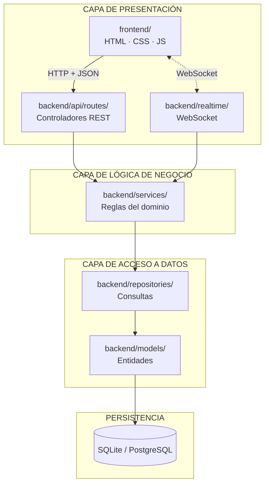
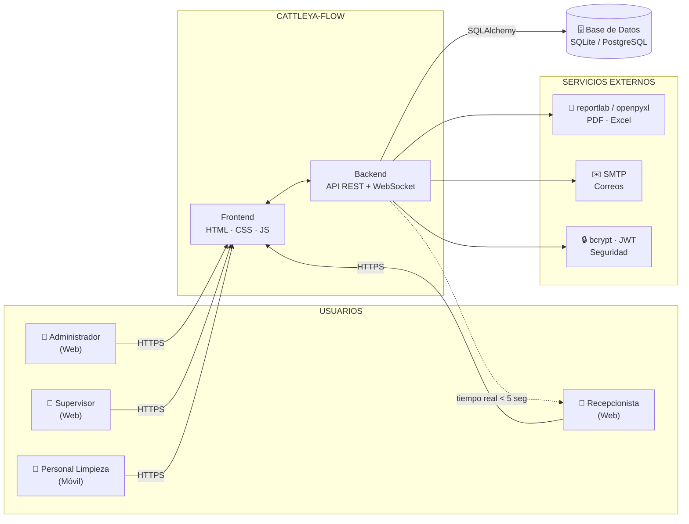

# Arquitectura de Software — Cattleya-Flow

## 1. Estilo arquitectónico: por capas (Layered / N-Tier)

Los tres fundamentos que respaldan la elección, y cómo se materializan en el
código:

### Separación de responsabilidades

Cada capa conoce únicamente la inmediatamente inferior:

La prueba de que la separación es real: **los servicios no importan nada de
FastAPI**. Lanzan excepciones de dominio (`TransicionInvalida`,
`EmailDuplicado`) y la capa de presentación las traduce a códigos HTTP mediante
un manejador registrado en `main.py`. Por eso la lógica de negocio podría
invocarse desde un script de consola o una tarea programada sin tocar una línea.

### Escalabilidad y mantenibilidad

Cambiar SQLite por PostgreSQL requiere editar **una** línea del `.env`. Ninguna
capa superior se entera, porque los repositorios encapsulan el acceso y
SQLAlchemy abstrae el motor.

Añadir un módulo futuro (reservas, facturación) significa agregar un servicio,
un repositorio y un controlador; nada de lo existente cambia.

### Desarrollo en equipo

La estructura permite trabajo paralelo sin conflictos: cada caso de uso tiene su
propio archivo de servicio y su propio archivo de frontend.

| Integrante | Backend | Frontend |
|---|---|---|
| Bolaños Melanie | `services/auth_service.py` | `js/auth.js` |
| Damian Emily | `services/habitacion_service.py` | `js/cambiar.js` |
| Guaraca Dayana | `services/habitacion_service.py` | `js/panel.js` |
| Martinez Jostin | `services/reporte_service.py` | `js/reportes.js` |
| Oñate Leonel | `services/usuario_service.py`, `historial_service.py` | `js/usuarios.js`, `js/historial.js` |

---

## 2. Elementos del sistema

### Usuarios / Clientes

| Actor | Acceso | Qué ve (RF-06) |
|---|---|---|
| Administrador | Navegador | Panel, Cambiar Estado, Historial, Reportes, Usuarios |
| Supervisor | Navegador | Panel, Historial, Reportes |
| Recepcionista | Navegador | Panel, Historial |
| Personal de Limpieza | Móvil / tablet | Cambiar Estado, Historial |

Definido en `backend/models/enums.py:NAVEGACION_POR_ROL`. Lo decide el servidor;
el frontend solo dibuja lo que recibe.

### Componentes propios

| Módulo | Archivo |
|---|---|
| Autenticación (JWT + bcrypt) | `services/auth_service.py`, `core/security.py` |
| Gestión de Habitaciones (máquina de estados) | `services/habitacion_service.py`, `models/habitacion.py` |
| Códigos QR por habitación | `services/qr_service.py` |
| WebSocket (tiempo real) | `realtime/websocket_manager.py` |
| Reportes | `services/reporte_service.py` |
| Historial / Auditoría | `services/historial_service.py`, `models/historial_accion.py` |
| Gestión de Usuarios | `services/usuario_service.py` |

### Servicios externos

| Servicio | Librería | Archivo |
|---|---|---|
| Generación PDF | `reportlab` | `services/generador_archivo.py` |
| Generación Excel | `openpyxl` | `services/generador_archivo.py` |
| Hashing de contraseñas | `bcrypt` | `core/security.py` |
| Tokens de sesión | `PyJWT` | `core/security.py` |
| Cifrado de datos sensibles (AES-256) | `cryptography` | `core/crypto.py` |
| Servidor SMTP | `smtplib` | `services/smtp_service.py` (modo simulado) |
| Códigos QR | `qrcode` | `services/qr_service.py` |

---

## 3. Gráfico de arquitectura

## 4. Flujo de comunicación

1. El usuario envía credenciales al **Módulo de Autenticación** por HTTPS. Este
   verifica el hash bcrypt en la base de datos y devuelve un token JWT.
2. El **Personal de Limpieza** cambia el estado de una habitación. El **Módulo
   de Gestión de Habitaciones** valida la transición, actualiza la BD y activa
   el **Módulo WebSocket**.
3. El **Módulo WebSocket** transmite el cambio a todos los clientes suscritos:
   la recepcionista ve el color verde sin recargar la página.
4. El **Administrador** solicita un reporte. El **Módulo de Reportes** consulta
   los registros, procesa las métricas y usa reportlab/openpyxl para generar el
   archivo.
5. Cada acción que modifica datos genera automáticamente un registro en
   **HistorialAccion**, garantizando trazabilidad total.

---

## 5. Decisiones de diseño

Cambios respecto al prototipo inicial, con su justificación:

| Decisión | Motivo |
|---|---|
| **Eliminar el selector de rol del login** | El prototipo permitía elegir "Administrador" en un desplegable y entrar. El rol ahora lo determina la cuenta en el servidor. Era un fallo de seguridad, no un detalle de interfaz. |
| **Validar transiciones en el servidor** | El prototipo permitía saltar de Sucia a Lista directamente. `validarTransicion()` vive en la entidad `Habitacion`, como impone el diagrama de clases. |
| **Métricas calculadas en el backend** | Nacen de los `RegistroLimpieza` reales. Calcularlas en el navegador obligaría a descargar todo el historial y daría cifras distintas por cliente. |
| **Hora local sin zona horaria** | Las columnas de SQLite no guardan zona. Mezclar fechas con y sin zona rompe las restas; guardar en UTC mostraría "12:45" donde el hotel espera "07:45". Un solo hotel, una sola zona. |
| **404 → resultado vacío en CU-04 y CU-06** | Los diagramas modelan "sin registros" como error 404. Un período sin limpiezas es un resultado legítimo de un filtro; se devuelven listas vacías y la pantalla lo indica. Tratar lo normal como excepción complica a quien consume el API. |
| **Lista → Sucia permitida por rol** | El documento la cita como transición inválida. Prohibirla del todo dejaría al sistema sin forma de devolver una habitación al ciclo tras el check-out. Se permite solo a recepción/supervisor/admin. |
| **`login()`/`logout()` en AuthService y no en Usuario** | El diagrama los ubica en la clase `Usuario`, pero generar un JWT y escribir auditoría son tareas de un servicio, no de una entidad de datos. `validarCredenciales()` sí permanece en la entidad. |
| **QR leído por la cámara nativa, sin escáner propio** | El diagrama modela `escanearQR` sobre la AppMovil. Un escáner en la app usaría `getUserMedia`, que los navegadores solo permiten sobre HTTPS o localhost: desde un celular apuntando a `http://192.168.x.x:8000` la cámara queda bloqueada. Codificando una URL en el QR, el teléfono lo abre con su cámara de fábrica y el flujo funciona sin certificados. |
| **Respaldo: abrir habitación por número** | El QR es un punto de fallo físico (se despega, se mancha) y deja a Recepción sin forma de hacer check-out si falla, porque su menú no incluye "Cambiar Estado". El botón 📷 Escanear permite escribir el número y llegar a la misma pantalla. |
| **Servidor publicado en `0.0.0.0`** | Atado a `127.0.0.1` solo aceptaba conexiones de la propia máquina: los QR apuntaban a la IP de red y ningún celular podía abrirlos. Requiere además una regla de firewall para el puerto 8000 (ver README sección 3). |
| **Estáticos con `Cache-Control: no-cache`** | Sin esa cabecera el navegador conserva versiones viejas de los `.js` y los mezcla con HTML nuevo, produciendo errores que no existen en el código fuente. `no-cache` obliga a revalidar; si nada cambió la respuesta sigue siendo un 304 vacío. Las imágenes sí se cachean: pesan más de 1 MB y no cambian. |
| **Email con AES-256 + índice ciego, en vez de columna en claro** | RNF-02 exige AES-256 para "datos sensibles", no solo bcrypt en contraseñas. AES-GCM usa un nonce aleatorio: cifrar el mismo email dos veces da resultados distintos, así que no se puede hacer `WHERE emailCifrado = ?` para el login. Se guarda además un HMAC-SHA256 determinista (`emailIndice`) del email normalizado: mismo email → mismo hash, así que sí permite búsqueda exacta por índice, sin ser reversible (no filtra el email si alguien solo tiene el hash). |

---

## 6. Rendimiento

- **Consultas indexadas** en las columnas que se filtran: `estado`, `piso`,
  `horaInicio`, `email`.
- **`joinedload`** en `registro_repository.py` evita el problema N+1: sin él,
  listar 50 registros dispararía 100 consultas adicionales para traer el usuario
  y la habitación de cada uno (RNF-05).
- **Filtrado en la capa de datos**, no en el navegador: el panel no descarga 24
  habitaciones para mostrar 6.
- **Operaciones pesadas en segundo plano**: la generación de archivos y el envío
  de correos no bloquean la respuesta HTTP.
