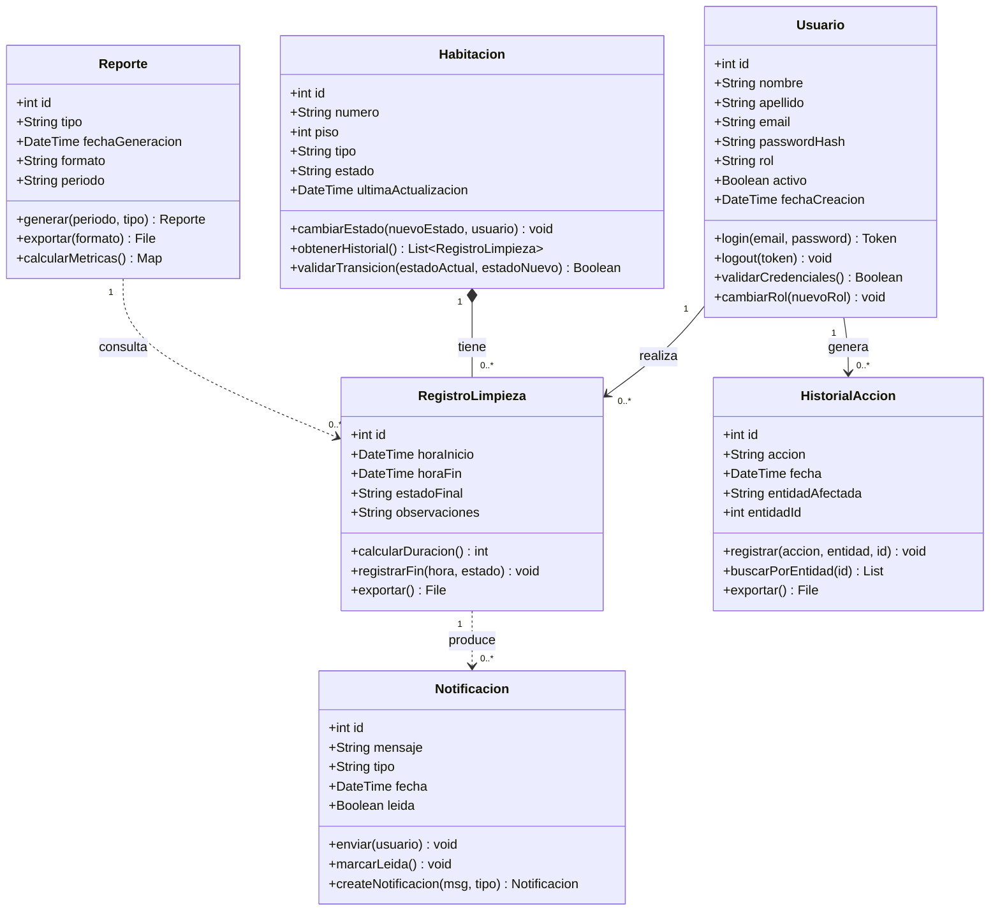
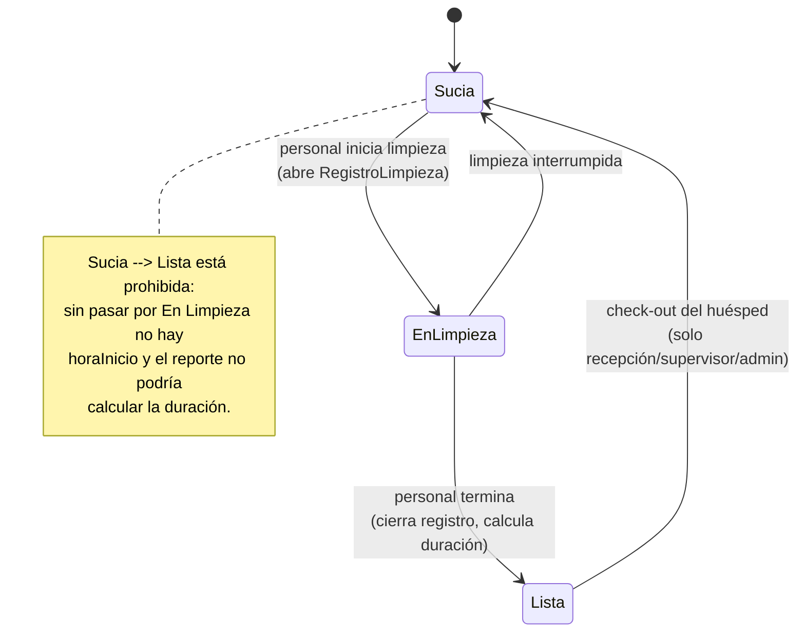

# Diagrama de Clases — Cattleya-Flow

Diagrama de clases unificado del sistema. En el documento original el código
Mermaid quedó partido en varios bloques sueltos; aquí está completo y se
renderiza (GitHub, VS Code con extensión Mermaid, o https://mermaid.live).

## Relaciones

| Relación | Tipo | Multiplicidad | Descripción |
|---|---|---|---|
| Usuario → RegistroLimpieza | Asociación | 1 a 0..* | Un usuario realiza múltiples registros de limpieza |
| Habitacion → RegistroLimpieza | Composición | 1 a 0..* | Una habitación tiene múltiples registros de limpieza |
| Usuario → HistorialAccion | Asociación | 1 a 0..* | Un usuario genera múltiples entradas de historial |
| RegistroLimpieza → Notificacion | Dependencia | 1 a 0..* | Un registro produce notificaciones al completarse |
| Reporte → RegistroLimpieza | Dependencia | 1 a 0..* | Un reporte consulta múltiples registros de limpieza |

**Por qué composición y no agregación** entre `Habitacion` y `RegistroLimpieza`:
un registro de limpieza no tiene sentido sin la habitación a la que pertenece.
En el código esto se traduce en `cascade="all, delete-orphan"`.

---

## Máquina de estados de Habitacion

