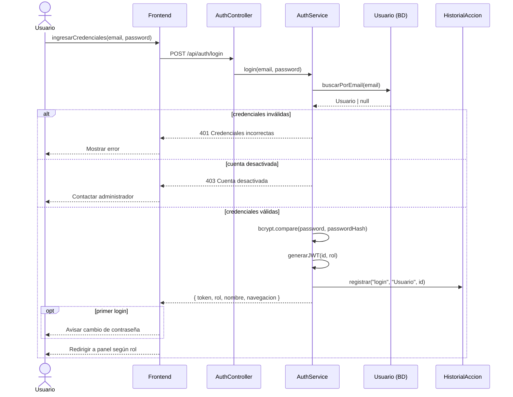
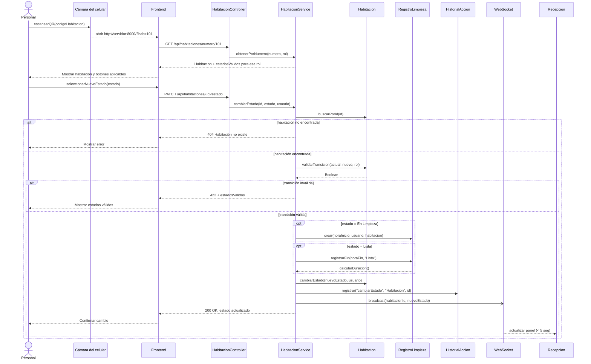
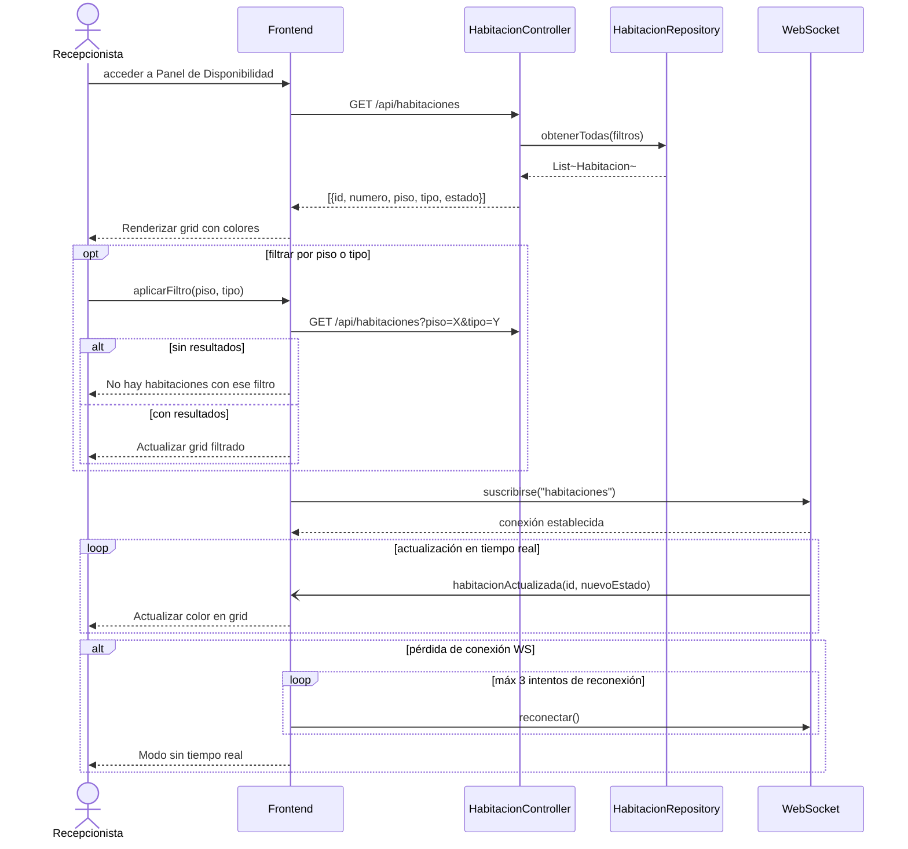
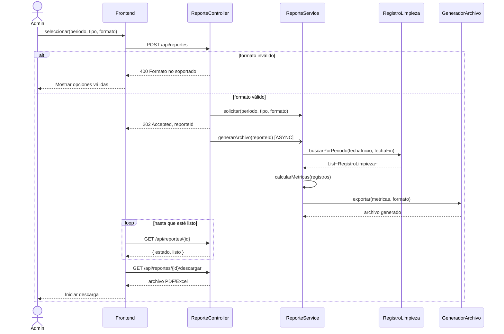
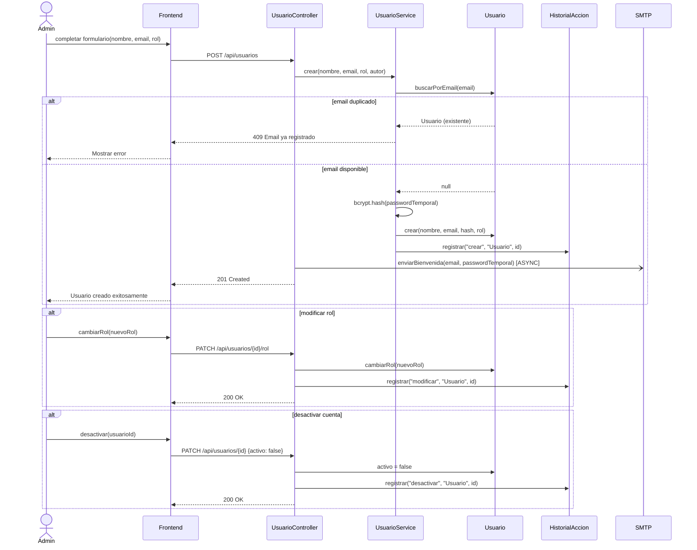
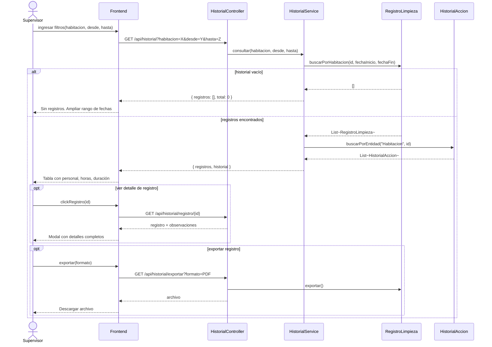

# Diagramas de Secuencia — Cattleya-Flow

Los seis casos de uso, con los nombres de los participantes tal como se
implementaron. En el documento original varios bloques Mermaid estaban
incompletos (cortados a media línea); aquí están completos y renderizables.

---

## CU-01 · Autenticarse en el Sistema — Bolaños Melanie

> **Nota:** la verificación de `activo` ocurre después de comprobar la
> contraseña. Al revés, permitiría averiguar qué correos están registrados.

---

## CU-02 · Cambiar Estado de Habitación — Damian Emily

El `broadcast` es asíncrono (`-)`): el personal recibe su confirmación sin
esperar a que todos los clientes conectados acusen recibo.

---

## CU-03 · Consultar Panel de Disponibilidad — Guaraca Dayana

---

## CU-04 · Generar Reportes de Productividad — Martinez Jostin

---

## CU-05 · Gestionar Usuarios — Oñate Leonel

El envío del correo es asíncrono (`-)`): si el servidor SMTP está caído, el
usuario igual se crea. De lo contrario, el SMTP sería un punto único de fallo
para dar de alta personal.

---

## CU-06 · Consultar Historial de Limpieza — Oñate Leonel

